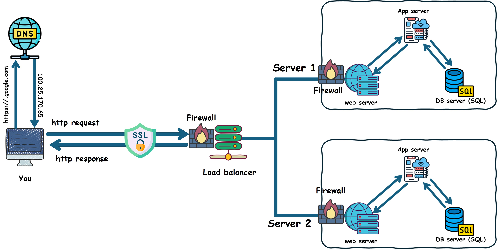

# What happens when you type [https://www.google.com](https://www.google.com) in your browser and press Enter

### 1. Browser Request :

your browser takes the URL which is [https://www.google.com](https://www.google.com) and sends a request to the DNS server.
The URL you provided is the address of the website you are requesting, but the URL is only for you, a human, it is made because it is easier for us to remember. But in fact, the internet uses a different method of addressing sites which is IPs, which look like 100.25.170.65, this is what computers understand, so to reach google.com, your browser sends the URL in a request to the DNS server.

### 2. DNS Lookup :
The DNS server looks up the IP associated with google.com (the URL), and when it finds it, it sends a response to your browser with the required IP.

### 3. Establishing a TCP Connection :
After obtaining the IP, your browser starts a TCP connection which means creating communication channels and breaking down messages into packets to be transmitted and the IP defines how to address and route each packet to make sure it reaches the right destination.

### 4. SSL/TLS Handshake :
Since you typed https://, this means that you requested a secure connection, so your browser initiates what is called a TLS handshake with the server. In this process,
1) Your browser requests a secure connection.
2) The server (google.com) responds by sending its SSL certificate, including the public key.
3) The browser verifies that the certificate is valid and trusted. This ensures the server is authentic.
4) The browser generates a symmetric session key and encrypts it with the server’s public key. This securely transmits the session key to the server.
5) The server decrypts the session key with its private key.
6) Both parties use the symmetric session key to encrypt and decrypt all transmitted data.

This ensures secure online transactions of data and keeps your information private and secure.

### 5. Load balancer :

Then, your request reaches the load balancer which is a server that distributes the incoming traffic across multiple web servers. So, the load balancer, here, should redirect your request to a more suitable web server.

### 6. Web Server :

Your request finally reaches your web server, which holds the files and data of the requested website `google.com` and, also, handles the HTTP requests by :

- serving the static requests.
- forwarding your request to a web application for dynamic content generation.

### 7. Application servers :

If the request is forwarded to the application server, the server executes codes (Python, java, etc...) and interacts with the database so that it generates the appropriate response.

### 8. Database :

A database is an organized collection of structured information or data.
So, if the request includes, adding, retrieving, editing, or deletion of data, the application server executes the appropriate code to fulfill the request and generates an appropriate response based on the result.

### 9. The response :

Once the necessary processing is complete, the server sends back an HTTP response containing the requested content. This response may include HTML, CSS, JavaScript, and other resources required to render the webpage.
